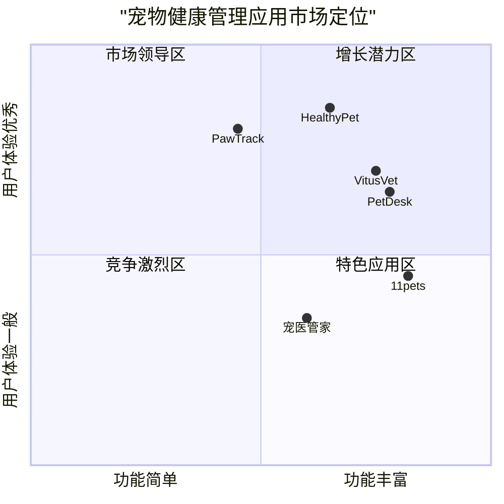
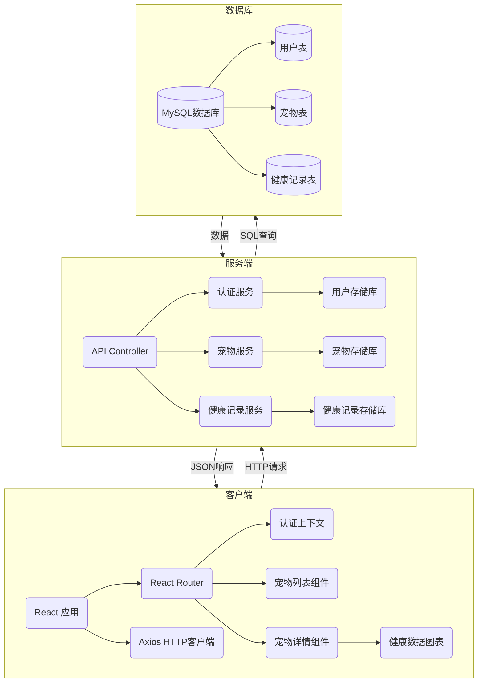

# HealthyPet 产品需求文档 (PRD)

## 1. 项目信息

- **项目名称**: HealthyPet 宠物健康管理系统
- **文档版本**: 1.0
- **编写日期**: 2024-02-27

## 2. 需求背景

HealthyPet是一款为宠物主人设计的宠物健康管理应用，旨在帮助宠物主人更好地管理宠物信息、追踪宠物健康状况，并建立用户个人账户系统。目前，应用已实现了基础的宠物信息展示和管理功能，现需要扩展应用功能，包括宠物详情页面、用户身份验证系统和后端数据库集成。

### 原始需求

已实现的功能：
- 宠物信息展示（包括照片和详细信息的卡片视图）
- 按类型筛选宠物（全部、狗、猫）
- 通过表单界面添加新宠物
- 使用Tailwind CSS实现的响应式设计

已创建的文件：
- /data/chats/us1vvd/workspace/pet_app_demo/src/App.jsx
- /data/chats/us1vvd/workspace/pet_app_demo/src/components/PetList.jsx
- /data/chats/us1vvd/workspace/pet_app_demo/src/components/AddPetForm.jsx
- /data/chats/us1vvd/workspace/pet_app_demo/src/components/PetCard.jsx
- /data/chats/us1vvd/workspace/pet_app_demo/src/data/mockPets.js
- /data/chats/us1vvd/workspace/pet_app_demo/src/utils/petUtils.js

需要添加的功能：
1. 宠物详情页面，查看完整信息和历史数据图表
2. 用户身份验证系统（登录/注册界面）
3. 后端与MySQL数据库集成

## 3. 产品目标

### 3.1 产品愿景

创建一个全面的宠物健康管理平台，帮助宠物主人有效管理宠物健康记录，提供数据可视化功能，并确保用户数据安全可靠地存储。

### 3.2 核心目标

1. **提升用户体验**：通过宠物详情页面和数据可视化，让用户更直观地了解宠物健康状况
2. **建立个人账户系统**：实现用户身份验证，保障个人数据安全
3. **数据持久化**：通过MySQL数据库集成，确保数据安全存储和快速检索

## 4. 用户故事

### 4.1 宠物主人

- 作为宠物主人，我希望能够注册和登录个人账户，以便安全地管理我的宠物信息
- 作为宠物主人，我希望能够查看我的宠物的详细健康记录，以便及时了解宠物的健康状况
- 作为宠物主人，我希望能够查看宠物的历史健康数据图表，以便观察宠物健康趋势

### 4.2 新用户

- 作为新用户，我希望能够简单快捷地注册账户，以便开始使用HealthyPet服务
- 作为新用户，我希望有清晰的引导，帮助我添加我的第一只宠物的信息

### 4.3 回访用户

- 作为回访用户，我希望能够安全地登录我的账户，并看到我所有宠物的信息
- 作为回访用户，我希望系统记住我的登录状态，避免频繁登录

## 5. 竞品分析

### 5.1 主要竞品

| 应用名称 | 优势 | 劣势 |
|---------|------|------|
| PetDesk | 完整的预约功能，强大的提醒系统 | 界面复杂，学习曲线较陡 |
| 11pets | 全面的宠物记录管理 | 免费版功能有限，数据可视化简单 |
| VitusVet | 与兽医诊所良好整合 | 主要针对美国市场，本地化不足 |
| 宠医管家 | 本地化好，医疗资源丰富 | 用户界面不够现代化，缺乏数据分析 |
| PawTrack | 优秀的数据可视化 | 缺乏社交功能，价格较高 |

### 5.2 竞争优势

- 更加注重健康数据的可视化和分析
- 简洁直观的用户界面设计
- 平衡健康管理和用户体验
- 完全响应式设计，适应各种设备

### 5.3 竞争象限图



## 6. 功能需求

### 6.1 宠物详情页面

#### 6.1.1 基本信息展示

**必须实现(P0)：**
- 显示宠物完整信息（名称、品种、年龄、性别、体重等）
- 显示宠物照片（支持多张照片浏览）
- 提供编辑宠物信息的功能

**应该实现(P1)：**
- 显示宠物主人信息
- 提供返回宠物列表的导航
- 显示宠物特殊需求或注意事项

**可选实现(P2)：**
- 宠物相册功能
- 宠物生活习惯记录

#### 6.1.2 健康数据可视化

**必须实现(P0)：**
- 体重变化趋势图表
- 基础健康指标（体温、心率等）历史记录图表
- 数据点清晰标记，支持悬停查看详细数据

**应该实现(P1)：**
- 提供时间范围筛选功能（如7天、30天、90天、全部）
- 支持不同指标的切换显示
- 异常数据高亮显示

**可选实现(P2)：**
- 数据导出功能
- 健康指标对比功能（与同类宠物或标准范围对比）
- 趋势预测分析

#### 6.1.3 健康记录管理

**必须实现(P0)：**
- 添加新的健康记录（体检、疫苗等）
- 查看历史健康记录列表
- 记录分类展示（疫苗、体检、日常、治疗等）

**应该实现(P1)：**
- 记录详情查看功能
- 记录编辑和删除功能
- 记录检索和筛选功能

**可选实现(P2)：**
- 健康提醒设置（如下次疫苗接种时间）
- 记录附件上传（如医院报告单照片）

### 6.2 用户身份验证系统

#### 6.2.1 用户注册

**必须实现(P0)：**
- 基础注册表单（用户名、密码、确认密码、邮箱）
- 表单验证（邮箱格式、密码强度、用户名唯一性）
- 注册成功后自动登录

**应该实现(P1)：**
- 支持第三方账号注册（如微信、Google）
- 邮箱验证流程
- 用户协议和隐私政策确认

**可选实现(P2)：**
- 手机号注册和短信验证
- 注册引导流程

#### 6.2.2 用户登录

**必须实现(P0)：**
- 基础登录表单（用户名/邮箱、密码）
- 登录状态保持（Remember me功能）
- 登录错误提示

**应该实现(P1)：**
- 第三方账号登录
- 密码找回功能
- 账号锁定机制（防止暴力破解）

**可选实现(P2)：**
- 双因素认证
- 异地登录提醒

#### 6.2.3 用户权限管理

**必须实现(P0)：**
- 基础路由保护（未登录用户重定向到登录页）
- 用户只能访问和管理自己的宠物信息

**应该实现(P1)：**
- 用户角色划分（普通用户、高级用户等）
- 宠物信息分享权限设置

**可选实现(P2)：**
- 多人协作管理同一宠物的功能
- 精细化权限控制（如只读权限、编辑权限等）

### 6.3 后端与MySQL数据库集成

#### 6.3.1 数据库设计

**必须实现(P0)：**
- 用户表（user）设计
- 宠物表（pet）设计
- 健康记录表（health_record）设计
- 表关系建立（外键约束）

**应该实现(P1)：**
- 图片/文件存储方案
- 索引优化
- 数据备份策略

**可选实现(P2)：**
- 分表策略（针对大数据量）
- 读写分离

#### 6.3.2 API接口设计

**必须实现(P0)：**
- 用户相关API（注册、登录、获取用户信息）
- 宠物相关API（CRUD操作）
- 健康记录相关API（增删改查）

**应该实现(P1)：**
- RESTful API设计规范
- API文档
- 接口限流处理

**可选实现(P2)：**
- GraphQL接口
- API版本控制

#### 6.3.3 安全与性能

**必须实现(P0)：**
- 密码加密存储
- JWT Token认证
- SQL注入防护

**应该实现(P1)：**
- HTTPS加密
- 数据库连接池
- 请求响应压缩

**可选实现(P2)：**
- 数据缓存策略
- 服务端渲染（SSR）优化

## 7. 技术规格

### 7.1 前端技术栈

- **框架**：React
- **UI库**：Tailwind CSS
- **状态管理**：Context API/Redux
- **路由**：React Router
- **HTTP客户端**：Axios
- **图表库**：Recharts

### 7.2 后端技术栈

- **框架**：Node.js + Express.js/Spring Boot
- **数据库**：MySQL
- **ORM**：Sequelize/MyBatis
- **认证**：JWT (JSON Web Token)
- **API规范**：RESTful

### 7.3 部署环境

- **前端**：Nginx
- **后端**：Node.js服务器/Java容器
- **数据库**：MySQL服务器
- **可选**：Docker容器化部署

## 8. 数据模型

### 8.1 用户表(users)

| 字段名 | 类型 | 描述 | 约束 |
|-------|------|------|------|
| id | INT | 用户ID | PRIMARY KEY, AUTO_INCREMENT |
| username | VARCHAR(50) | 用户名 | NOT NULL, UNIQUE |
| email | VARCHAR(100) | 电子邮箱 | NOT NULL, UNIQUE |
| password | VARCHAR(255) | 加密密码 | NOT NULL |
| avatar | VARCHAR(255) | 头像URL | NULL |
| created_at | TIMESTAMP | 创建时间 | DEFAULT CURRENT_TIMESTAMP |
| updated_at | TIMESTAMP | 更新时间 | DEFAULT CURRENT_TIMESTAMP ON UPDATE CURRENT_TIMESTAMP |

### 8.2 宠物表(pets)

| 字段名 | 类型 | 描述 | 约束 |
|-------|------|------|------|
| id | INT | 宠物ID | PRIMARY KEY, AUTO_INCREMENT |
| user_id | INT | 所属用户ID | FOREIGN KEY(users) |
| name | VARCHAR(50) | 宠物名称 | NOT NULL |
| type | VARCHAR(20) | 宠物类型（狗/猫等） | NOT NULL |
| breed | VARCHAR(50) | 宠物品种 | NULL |
| birth_date | DATE | 出生日期 | NULL |
| gender | ENUM | 性别 | NULL |
| weight | DECIMAL(5,2) | 体重(kg) | NULL |
| image_url | VARCHAR(255) | 宠物照片URL | NULL |
| description | TEXT | 宠物描述 | NULL |
| created_at | TIMESTAMP | 创建时间 | DEFAULT CURRENT_TIMESTAMP |
| updated_at | TIMESTAMP | 更新时间 | DEFAULT CURRENT_TIMESTAMP ON UPDATE CURRENT_TIMESTAMP |

### 8.3 健康记录表(health_records)

| 字段名 | 类型 | 描述 | 约束 |
|-------|------|------|------|
| id | INT | 记录ID | PRIMARY KEY, AUTO_INCREMENT |
| pet_id | INT | 所属宠物ID | FOREIGN KEY(pets) |
| record_type | VARCHAR(30) | 记录类型（体检/疫苗/治疗等） | NOT NULL |
| record_date | DATE | 记录日期 | NOT NULL |
| weight | DECIMAL(5,2) | 体重(kg) | NULL |
| temperature | DECIMAL(4,1) | 体温(°C) | NULL |
| heart_rate | INT | 心率(bpm) | NULL |
| description | TEXT | 记录描述 | NULL |
| notes | TEXT | 额外记录 | NULL |
| created_at | TIMESTAMP | 创建时间 | DEFAULT CURRENT_TIMESTAMP |
| updated_at | TIMESTAMP | 更新时间 | DEFAULT CURRENT_TIMESTAMP ON UPDATE CURRENT_TIMESTAMP |

## 9. 界面设计

### 9.1 宠物详情页面设计

#### 页面布局

```
+-----------------------------------------+
| 导航栏 (App Header)                      |
+-----------------------------------------+
| 返回按钮 | 宠物名称 | 编辑按钮           |
+-----------------------------------------+
| 宠物照片 | 基本信息 (姓名、品种、年龄等) |
|         |                               |
+-----------------------------------------+
| 标签页导航:                              |
| [基本信息] [健康记录] [数据图表]         |
+-----------------------------------------+
| 内容区域:                               |
|                                         |
| (根据选中标签页显示相应内容)            |
|                                         |
|                                         |
+-----------------------------------------+
| 底部操作栏 (添加记录按钮等)             |
+-----------------------------------------+
```

### 9.2 用户认证界面设计

#### 登录页面

```
+-----------------------------------------+
| HealthyPet Logo                         |
+-----------------------------------------+
| 登录                                    |
|                                         |
| 用户名/邮箱:                            |
| [                                    ]  |
|                                         |
| 密码:                                   |
| [                                    ]  |
|                                         |
| [记住我] [忘记密码?]                    |
|                                         |
| [登录按钮]                              |
|                                         |
| 没有账户? [注册]                        |
|                                         |
| [第三方登录按钮]                        |
+-----------------------------------------+
```

#### 注册页面

```
+-----------------------------------------+
| HealthyPet Logo                         |
+-----------------------------------------+
| 注册新账户                              |
|                                         |
| 用户名:                                 |
| [                                    ]  |
|                                         |
| 邮箱:                                   |
| [                                    ]  |
|                                         |
| 密码:                                   |
| [                                    ]  |
|                                         |
| 确认密码:                               |
| [                                    ]  |
|                                         |
| [同意服务条款和隐私政策]                |
|                                         |
| [注册按钮]                              |
|                                         |
| 已有账户? [登录]                        |
+-----------------------------------------+
```

## 10. 数据流程图

### 10.1 用户登录/注册流程

```mermaid
sequenceDiagram
    参与者 用户
    参与者 前端
    参与者 后端
    参与者 数据库
    
    用户->>前端: 输入登录/注册信息
    前端->>前端: 表单验证
    前端->>后端: 提交用户凭证
    后端->>数据库: 验证/创建用户
    数据库-->>后端: 返回用户数据
    后端->>后端: 生成JWT Token
    后端-->>前端: 返回Token和用户信息
    前端->>前端: 存储Token和用户信息
    前端-->>用户: 登录成功/跳转首页
```

### 10.2 宠物健康记录流程

```mermaid
sequenceDiagram
    参与者 用户
    参与者 前端
    参与者 后端
    参与者 数据库
    
    用户->>前端: 进入宠物详情页面
    前端->>后端: 请求宠物数据和健康记录
    后端->>数据库: 查询宠物和健康记录
    数据库-->>后端: 返回数据
    后端-->>前端: 返回宠物信息和健康记录
    前端->>前端: 渲染宠物信息和图表
    前端-->>用户: 展示宠物详情和健康数据
    
    用户->>前端: 添加新的健康记录
    前端->>前端: 表单验证
    前端->>后端: 提交新健康记录
    后端->>数据库: 保存健康记录
    数据库-->>后端: 确认保存
    后端-->>前端: 返回成功状态
    前端->>前端: 更新数据和图表
    前端-->>用户: 显示成功消息
```

## 11. API设计

### 11.1 用户API

#### POST /api/users/register
- 功能：用户注册
- 请求体：
  ```json
  {
    "username": "petlover1",
    "email": "example@mail.com",
    "password": "securePassword123"
  }
  ```
- 响应：
  ```json
  {
    "status": "success",
    "data": {
      "user": {
        "id": 1,
        "username": "petlover1",
        "email": "example@mail.com"
      },
      "token": "eyJhbGciOiJIUzI1NiIsInR5cCI6IkpXVCJ9..."
    }
  }
  ```

#### POST /api/users/login
- 功能：用户登录
- 请求体：
  ```json
  {
    "email": "example@mail.com",
    "password": "securePassword123"
  }
  ```
- 响应：
  ```json
  {
    "status": "success",
    "data": {
      "user": {
        "id": 1,
        "username": "petlover1",
        "email": "example@mail.com"
      },
      "token": "eyJhbGciOiJIUzI1NiIsInR5cCI6IkpXVCJ9..."
    }
  }
  ```

### 11.2 宠物API

#### GET /api/pets
- 功能：获取当前用户的所有宠物
- 请求头：Authorization: Bearer {token}
- 响应：
  ```json
  {
    "status": "success",
    "data": {
      "pets": [
        {
          "id": 1,
          "name": "旺财",
          "type": "dog",
          "breed": "金毛",
          "birth_date": "2020-05-15",
          "image_url": "http://example.com/pets/1.jpg"
        },
        ...
      ]
    }
  }
  ```

#### GET /api/pets/:id
- 功能：获取特定宠物的详细信息
- 请求头：Authorization: Bearer {token}
- 响应：
  ```json
  {
    "status": "success",
    "data": {
      "pet": {
        "id": 1,
        "user_id": 1,
        "name": "旺财",
        "type": "dog",
        "breed": "金毛",
        "birth_date": "2020-05-15",
        "gender": "male",
        "weight": 25.5,
        "image_url": "http://example.com/pets/1.jpg",
        "description": "活泼好动，喜欢玩球"
      }
    }
  }
  ```

#### POST /api/pets
- 功能：添加新宠物
- 请求头：Authorization: Bearer {token}
- 请求体：
  ```json
  {
    "name": "旺财",
    "type": "dog",
    "breed": "金毛",
    "birth_date": "2020-05-15",
    "gender": "male",
    "weight": 25.5,
    "image_url": "http://example.com/pets/1.jpg",
    "description": "活泼好动，喜欢玩球"
  }
  ```
- 响应：
  ```json
  {
    "status": "success",
    "data": {
      "pet": {
        "id": 1,
        "user_id": 1,
        "name": "旺财",
        "type": "dog",
        ...
      }
    }
  }
  ```

### 11.3 健康记录API

#### GET /api/pets/:id/health-records
- 功能：获取特定宠物的健康记录
- 请求头：Authorization: Bearer {token}
- 查询参数：?page=1&limit=10&type=checkup
- 响应：
  ```json
  {
    "status": "success",
    "data": {
      "records": [
        {
          "id": 1,
          "pet_id": 1,
          "record_type": "checkup",
          "record_date": "2023-12-15",
          "weight": 25.5,
          "temperature": 38.5,
          "heart_rate": 95,
          "description": "常规体检，健康状况良好"
        },
        ...
      ],
      "pagination": {
        "total": 25,
        "page": 1,
        "limit": 10,
        "pages": 3
      }
    }
  }
  ```

#### POST /api/pets/:id/health-records
- 功能：添加新的健康记录
- 请求头：Authorization: Bearer {token}
- 请求体：
  ```json
  {
    "record_type": "checkup",
    "record_date": "2023-12-15",
    "weight": 25.5,
    "temperature": 38.5,
    "heart_rate": 95,
    "description": "常规体检，健康状况良好",
    "notes": "建议增加运动量"
  }
  ```
- 响应：
  ```json
  {
    "status": "success",
    "data": {
      "record": {
        "id": 1,
        "pet_id": 1,
        "record_type": "checkup",
        ...
      }
    }
  }
  ```

## 12. 系统集成

### 12.1 前端与后端集成

1. **API通信**
   - 前端使用Axios库发起HTTP请求
   - 采用JWT令牌进行身份认证
   - 请求拦截器添加认证头部
   - 响应拦截器处理错误（如401未授权）

2. **状态管理**
   - 使用Context API或Redux管理全局状态
   - 保存用户认证信息和基础数据
   - 实现持久化登录状态

### 12.2 后端与数据库集成

1. **数据库连接**
   - 使用ORM框架（Sequelize/MyBatis）
   - 采用连接池管理数据库连接
   - 实现事务处理确保数据一致性

2. **数据访问层**
   - 设计DAO层或Repository模式
   - 实现CRUD操作的封装
   - 提供查询优化和缓存策略

## 13. 系统架构图



## 14. 开发与实施计划

### 14.1 开发阶段

1. **阶段一：数据库和后端设计**（2周）
   - 数据库表设计和创建
   - 用户认证系统实现
   - 基础API开发

2. **阶段二：前端用户认证**（1.5周）
   - 登录/注册页面开发
   - 认证状态管理实现
   - 受保护路由设置

3. **阶段三：宠物详情页面**（2周）
   - 基础信息展示界面
   - 健康记录CRUD功能
   - 数据可视化图表

4. **阶段四：系统集成与测试**（1.5周）
   - 前后端集成测试
   - 性能优化
   - 缺陷修复

### 14.2 测试计划

1. **单元测试**
   - 后端API测试
   - 前端组件测试

2. **集成测试**
   - 前后端通信测试
   - 数据流测试

3. **用户界面测试**
   - 响应式设计测试
   - 交互体验测试

4. **性能测试**
   - 数据库查询性能
   - 前端渲染性能

### 14.3 部署计划

1. **开发环境部署**
   - 本地开发环境设置
   - 开发数据库配置

2. **测试环境部署**
   - 测试服务器部署
   - 自动化测试配置

3. **生产环境部署**
   - 服务器准备和配置
   - 数据库部署和初始化
   - 前端静态资源部署
   - 持续集成与部署流程设置

## 15. 开放问题

1. **数据迁移策略**：现有的模拟数据如何迁移到MySQL数据库？
2. **图片存储方案**：是否需要专门的图片服务器或云存储服务？
3. **用户认证安全措施**：是否需要实现更复杂的安全措施，如IP限制、验证码等？
4. **多语言支持**：应用是否需要支持多语言？
5. **扩展支持更多宠物类型**：未来是否计划支持更多种类的宠物？

## 16. 结论

HealthyPet宠物健康管理系统将通过本PRD中定义的三个新功能（宠物详情页面、用户身份验证系统和MySQL数据库集成）显著提升产品价值和用户体验。这些功能将使应用从一个简单的宠物信息展示工具转变为一个完整的宠物健康管理平台，支持用户创建个人账户、详细记录宠物健康状况并通过可视化图表直观地了解宠物健康趋势。

本产品的成功实施将为宠物主人提供一个安全、高效、直观的宠物健康管理工具，帮助他们更好地照顾自己的宠物。通过持续迭代和用户反馈，HealthyPet将不断优化和扩展功能，满足用户日益增长的需求。
